= Introduction to Functional Mockup Interface
:customcss: css/slides.css
:revealjs_customtheme: css/sky.css
:revealjs_width: 1408
:revealjs_height: 792

== Motivations

=== Process

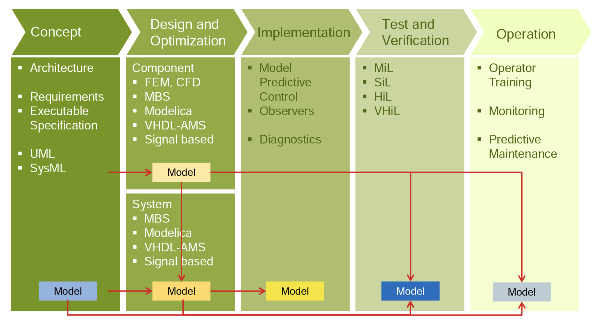

=== Challenges

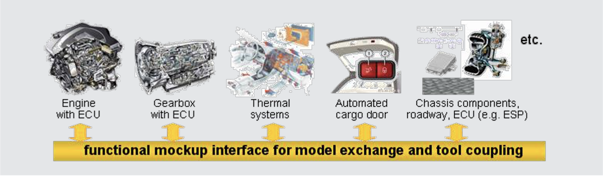

[.small.left]
--
Challenges for Functional Mock-up:

- Different tools and languages are involved
- No standards for model interface and co-simulation available
- Protection of model IP and know-how of supplier
--

== FMI Main Design Idea

[.columns]
=== FMI Main design idea

[.column.x-small]
--
- FMI for Model Exchange

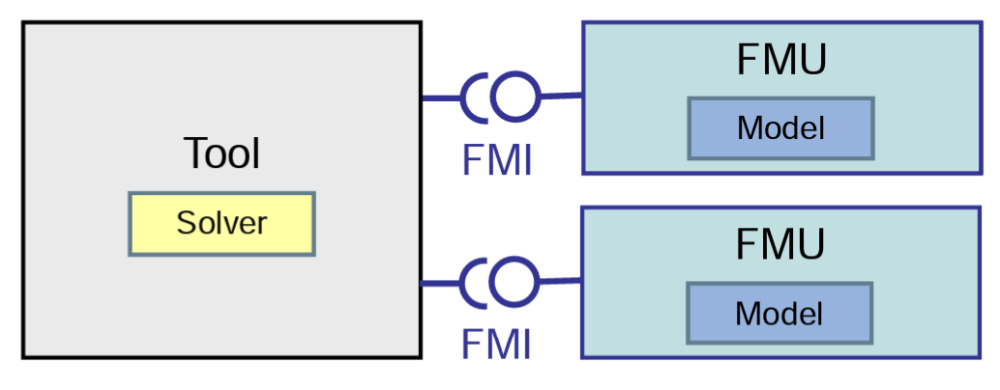
--

[.column.x-small]
--
- FMI for Co-Simulation

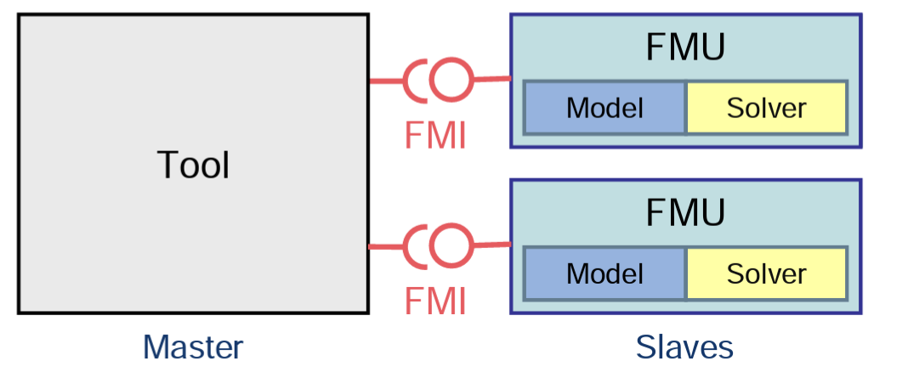
--

[.columns]
=== FMI Main design idea

[.column.small]
--
- A component which implements the interface is called a Functional Mockup Unit (FMU)

* Separation of:
** Description of interface data: XML file
** Functionality: Application Programming Interface (API) in C

* An FMU is a zipped file (*.fmu) containing:
** modelDescription.xml
** Implementation in source and/or binary form
** Additional data and functionality
--

[.column.x-small]
--
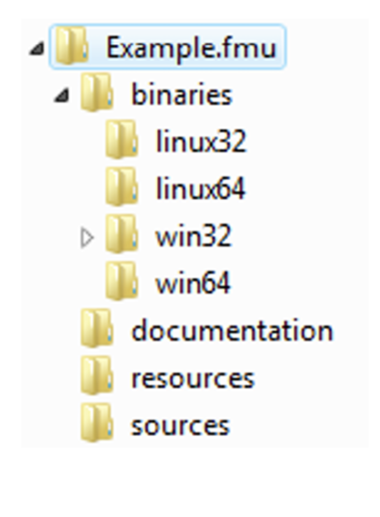
--

=== FMI Model Description

.Model description stored in an XML file
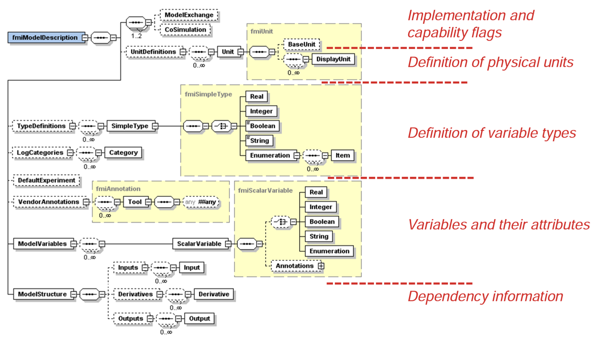

== C interface

[.small]
--
- Instantiation:

    fmiComponent fmilnstantiate (fmiString instanceName, ...)

- Returns an instance of the FMU. Returned `fmicomponent` is an argument of the other interface functions.
- Functions for initialization, termination, destruction
- Support of real, integer, boolean, and string inputs, outputs, parameters
- `Set` and `Get`` functions for each type:
]source,c++]
----
    fmiStatus fmiSetReal (fmiComponent c,
                          const fmivalueReference vr [] , size t nvr,
                          const fmireal value [])
    fmistatus fmisetinteger(fmicomponent $c$,
                            const fmivalueReference vr[], size t nvr,
                            const fmilnteger value[])
----
- Identification by valueReference, defined in the XML description file for each variable
--

== FMI for Model Exchange

=== Features

[.small]
--
- Functionality of state of the art modeling methods can be expressed
- Support of continuous-time and discrete-time systems
- Model is described by differential, algebraic, discrete equations
- Interface for solution of hybrid Ordinary Differential Equations (ODE)
- Handling of time, state and step events, event iteration
- Discarding of invalid inputs, state variables
- No explicit function call for computation of model algorithm
- FMU decides which part is to be computed, when a `fmi2get` Xxx function is called
- Allows for efficient caching algorithms
--

=== Data Exchange

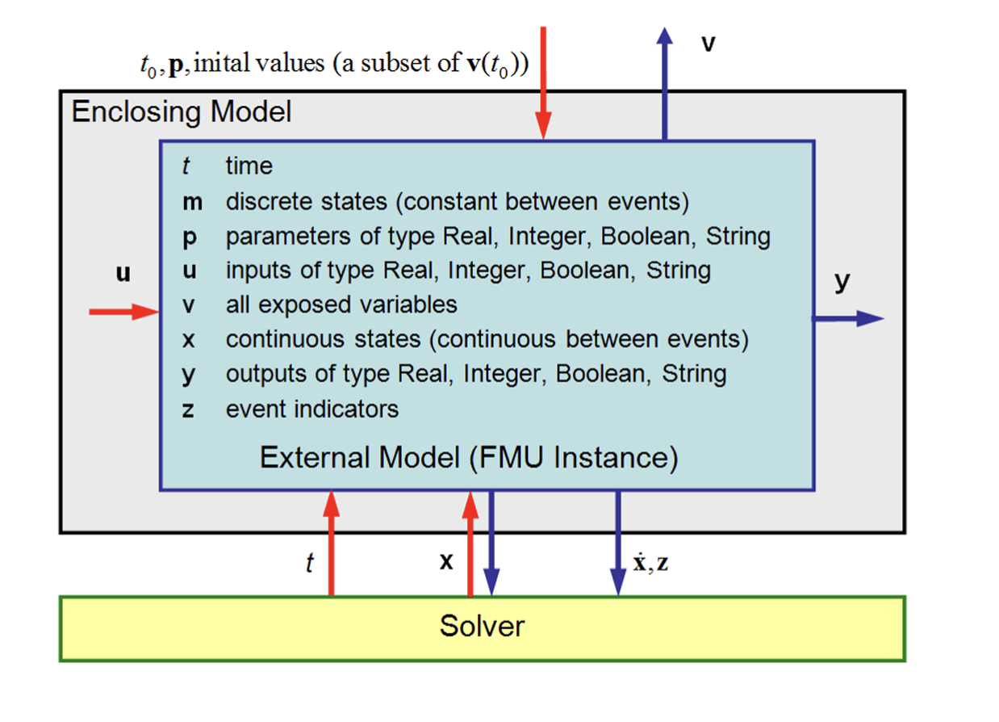

== FMI for Co-Simulation

[.columns]
=== Features

[.column.x-small]
--
Motivation

- Simulation of heterogeneous systems
- Partitioning and parallelization of large systems
- Multirate integration
- Hardware-in-the-loop simulation

Definition:

- Coupling of several simulation tools
- Each tool treats one part of a modular coupled problem
- Data exchange is restricted to discrete communication points
- Subsystems are solved independently between communication points
--

[.column.x-small]
--
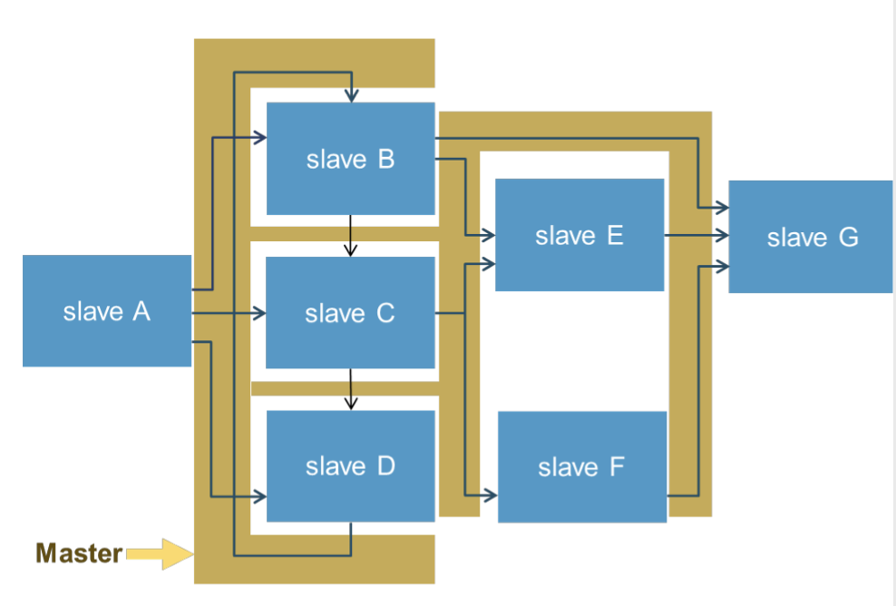
--

=== FMI for Co-Simulation

* FMI enables sophisticated Co-Simulation Master Algorithms:
** Optional variable communication step size
** Optional higher-order approximation of inputs and outputs
** Optional repetition of communication steps
- Capabilities of the slave are contained in the XML-file
- Master can decide which coupling algorithm is applicable

**Tools which do not support all features are not excluded**

- Asynchronous execution (allows for parallel execution)

=== Data Exchange

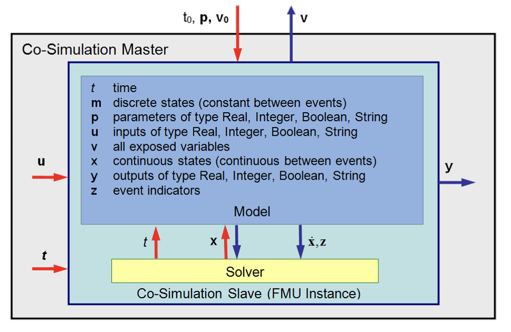

[NOTE]
.Additional features
--
- Status information
- Derivatives of inputs, outputs w.r.t. time for support of higher order approximation between communication steps
--

== ME and CS

[.columns]
=== Comparison

[.column.x-small]
--
Model Exchange:
(One model evaluation)

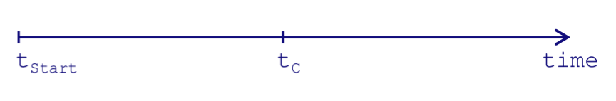

[source,cpp]
----
/* Set inputs*/ fmiSetReal(m, id_u, u, nu); fmiSetTime(m, tC);
fmiSetContinuousStates(m, x, nx);
/* Get outputs*/ fmiGetReal(m, id_y, y, ny);
fmiGetDerivatives(m, derx, nx); 
fmiGetEventIndicators(m, z, nz);
----
--

[.column.x-small]
--
Co-Simulation
(One communication step)

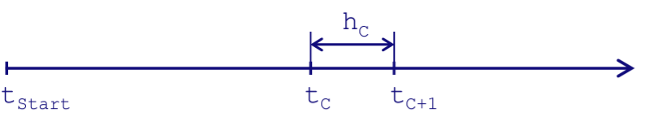

[source,c]
----
/* Set inputs*/
fmisetReal(s, id,u, u, nu);
/* Do computation*
fmidostep(s, tC, hC, fmiTrue);
/* Get outputs*/
fmigetReal (s, id, y,y, ny);
----
--

== Use Cases

[.columns]
=== Automotive Use Cases

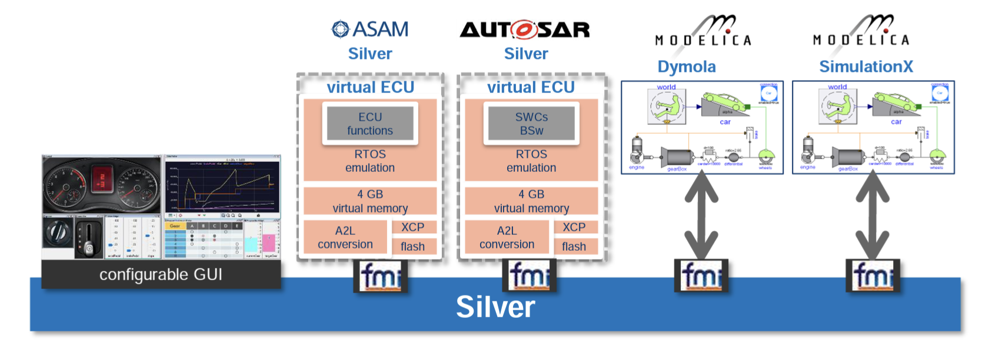

